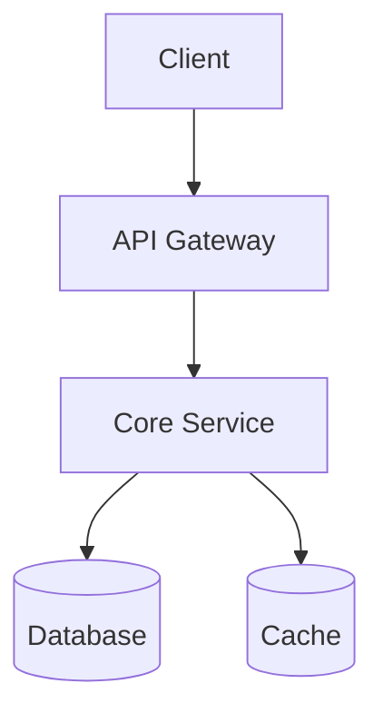

# Architecture: default

## System Diagram

## Component Design
| Component | Responsibility |
|-----------|---------------|
| API Gateway | Auth, routing, rate limiting |
| Core Service | Business logic |
| Database | Persistent storage |

## Security Architecture
- Auth: JWT with HTTP-only cookies
- Encryption: TLS 1.3 in transit, AES-256 at rest
- Rate limiting: 100 req/min per user
