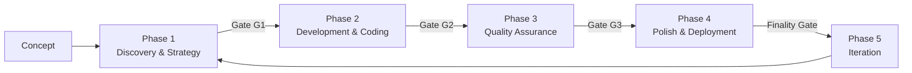

<div align="center">

# ⚡ HALF — Hermes Agentic Lifecycle Framework

**Transform high-level business concepts into production-ready software through autonomous, multi-agent orchestration.**

[](https://github.com/iknowkungfubar/Hermes-Agentic-Lifecycle-Framework/actions/workflows/ci.yml)
[](LICENSE)
[](pyproject.toml)
[](https://mypy-lang.org/)
[](https://docs.astral.sh/ruff/)
[](tests/)

</div>

---

## What is HALF?

**HALF** is a modular, open-source framework that enables AI agents to autonomously execute the full software development lifecycle. It implements a **5-phase structured SDLC** with built-in quality gates, fail-safe protocols, and explicit human checkpoints.



### Core Principles

- **Agent executes, human directs** — Agents handle implementation; humans set intent, review checkpoints, own decisions
- **Gates before progress** — Every phase has mandatory quality gates
- **Fail-safe by design** — 3-level escalation: step retry → phase retry → human gap report
- **TDD is mandatory** — Harness-first: write failing tests before any implementation
- **Codification Imperative** — Every manual fix becomes a durable improvement to the agent system

---

## Quick Start

```bash
# 1. Clone
git clone https://github.com/iknowkungfubar/Hermes-Agentic-Lifecycle-Framework.git
cd Hermes-Agentic-Lifecycle-Framework

# 2. Install
pip install uv
uv sync --group dev

# 3. Verify
make test

# 4. Bootstrap a project
./scripts/genesis.sh --project my-app --mode full

# 5. Use in Hermes Agent
skill_view(name="half")
```

---

## The 5 Phases

| Phase | Objective | Agent Skills | Human Checkpoint |
|-------|-----------|-------------|------------------|
| **1: Discovery & Strategy** | Requirements → Spec → Architecture | Discovery, Specification, Architect | **Review spec + arch** |
| **2: Development & Coding** | TDD implementation with Tri-Phasic Loop | Scaffold, Research, Plan, Implement, Simplify | — |
| **3: Quality Assurance** | Test completeness + security red-teaming | Testing, Security, Integration | **Review test + security report** |
| **4: Polish & Deployment** | IaC + CI/CD + production readiness | Infrastructure, CICD, Launch | **Finality Gate sign-off** |
| **5: Iteration** | Monitoring + triage + codification | Observe, Iterate, Codify | — |

### Three Human Checkpoints (non-negotiable)

1. **After Phase 1** — Review spec and architecture before code is written
2. **After Phase 3** — Review test results, security findings, merge confidence
3. **After Phase 4** — Review launch readiness via Finality Gate (cryptographic sign-off)

---

## Architecture

```
┌─────────────────────────────────────────────────────────────┐
│              Command Center (Tauri Desktop GUI)              │
│  ┌──────────────┐  ┌───────────────┐  ┌──────────────────┐  │
│  │ Focalboard   │  │ Agent Mail    │  │ Grafana/Laminar  │  │
│  │ (Kanban)     │  │ (Messages)    │  │ (Observability)  │  │
│  └──────┬───────┘  └──────┬────────┘  └────────┬─────────┘  │
└─────────┼──────────────────┼────────────────────┼────────────┘
          │                  │                    │
          ▼                  ▼                    ▼
┌─────────────────────────────────────────────────────────────┐
│                 LangGraph State Machine                      │
│    Phase 1 → Phase 2 → Phase 3 → Phase 4 → Phase 5         │
│                    ↕ (iteration cycle)                       │
│        16 Agent Skills + Code-Simplifier + Gates            │
└─────────────────────────────────────────────────────────────┘
          │                  │                    │
          ▼                  ▼                    ▼
┌──────────────┐  ┌──────────────────┐  ┌────────────────────┐
│ Observability│  │ Execution        │  │ CI/CD (GitHub      │
│ (LangWatch,  │  │ Sandbox (Docker/ │  │ Actions → Deploy)  │
│  Laminar,    │  │ Podman)          │  │ with per-stage     │
│  Prometheus) │  │ Read-only Vault  │  │ quality gates      │
└──────────────┘  └──────────────────┘  └────────────────────┘
```

---

## Repository Structure

```
src/
├── half/               # Package root + CLI entrypoint
├── agents/             # 16 agent skill implementations
├── core/               # Orchestrator, gates, fail-safe, error budget
├── runtime/            # LangGraph graph, checkpointer, nodes
├── state/              # LangGraph security (CVE mitigations)
├── agent_mail/         # Decentralized agent coordination
├── half_voice/         # Speech-to-text and text-to-speech
├── half_focalboard/    # Kanban API client
└── half_sidecar.py     # Tauri Python sidecar

scripts/                # Bootstrap, genesis, deploy, install-foss
templates/              # fail-safes.yaml, gap-report.md
references/             # quickstart-execution.md
docker/                 # Dockerfile + docker-compose (app + FOSS stack)
vault_root/             # Obsidian RAG vault structure
```

---

## Fail-Safe Protocol

```yaml
escalation:
  level_1: "Step retry (×3) — auto-analyze failure, adjust, retry"
  level_2: "Phase retry (×2) — re-run phase with expanded context"
  level_3: "Human escalation — generate Gap Report, pause pipeline"
circuit_breakers:
  - ">5 test failures → halt phase 2"
  - "CRITICAL security finding → halt phase 3"
  - "coverage drops >5% → warn before proceeding"
error_budget:
  total: "100 points / 30 days"
  thresholds: {warning: "<40%", critical: "<20%", exhausted: "0%"}
```

---

## Security

| CVE | Component | Mitigation |
|-----|-----------|------------|
| CVE-2025-67644 | LangGraph SQLite | Metadata allowlist validates all filter keys |
| CVE-2026-28277 | LangGraph msgpack | JSON-safe serialization prevents RCE |

- Execution sandbox (read-only vault mount, network-isolated)
- Dangerous command denylist (rm -rf, dd, mkfs, format)
- Path traversal protection via pre-execution hooks
- Secrets detection in CI (trufflehog)
- Weekly dependency scans via Dependabot

---

## Development

```bash
make install       # Install dependencies
make lint          # Run ruff linter
make typecheck     # Run mypy type checker
make test          # Run test suite (62 tests)
make ready         # Full CI pipeline
make ship          # Release build (Tauri + Python)
```

---

## License

MIT — See [LICENSE](LICENSE).

Built by [Turin Tech Solutions](mailto:josh@turintechsolutions.com) with Hermes Agent.

---

<div align="center">
<a href="docs/getting-started/installation.md">Installation</a> •
<a href="docs/getting-started/quickstart.md">Quick Start</a> •
<a href="docs/guide/overview.md">User Guide</a> •
<a href="CONTRIBUTING.md">Contributing</a> •
<a href="CHANGELOG.md">Changelog</a>
</div>
