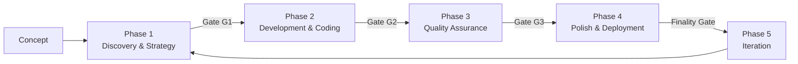

<div align="center">

# ⚡ HALF — Hermes Agentic Lifecycle Framework

**Transform high-level business concepts into production-ready software through autonomous, multi-agent orchestration.**

[](https://github.com/iknowkungfubar/Hermes-Agentic-Lifecycle-Framework/actions/workflows/ci.yml)
[](https://pypi.org/project/hermes-half/)
[](LICENSE)
[](pyproject.toml)
[](https://mypy-lang.org/)
[](tests/)
[](pyproject.toml)

</div>

---

## What is HALF?

**HALF** is a modular, open-source framework that enables AI agents to autonomously execute the full software development lifecycle. It implements a **5-phase structured SDLC** with built-in quality gates, fail-safe protocols, explicit human checkpoints, and a **GUI-first Command Center**.



### Core Principles

- **Agent executes, human directs** — Agents handle implementation; humans set intent, review checkpoints, own decisions
- **Gates before progress** — Every phase has mandatory quality gates
- **Fail-safe by design** — 3-level escalation: step retry → phase retry → human gap report
- **TDD is mandatory** — Harness-first: write failing tests before any implementation
- **Codification Imperative** — Every manual fix becomes a durable improvement to the agent system
- **No-slop context** — Agents earn context through hierarchical RAG, not flat directory dumps

---

## Quick Start

```bash
# Install from PyPI (30 seconds)
pip install hermes-half
half version
# → HALF v1.0.1

# Full local setup with GUI + services
git clone https://github.com/iknowkungfubar/Hermes-Agentic-Lifecycle-Framework.git
cd Hermes-Agentic-Lifecycle-Framework
bash scripts/setup.sh
./src-tauri/target/release/half-command-center
```

---

## The 5 Phases

| Phase | Objective | Agent Skills | Human Checkpoint |
|-------|-----------|-------------|------------------|
| **1: Discovery & Strategy** | Requirements → Spec → Architecture | Discovery, Specification, Architect | **Review spec + arch** |
| **2: Development & Coding** | TDD implementation with Tri-Phasic Loop | Scaffold, Research, Plan, Implement, Simplify | — |
| **3: Quality Assurance** | Test completeness + security red-teaming | Testing, Security, Integration | **Review test + security report** |
| **4: Polish & Deployment** | IaC + CI/CD + production readiness | Infrastructure, CICD, Launch | **Finality Gate sign-off** |
| **5: Iteration** | Monitoring + triage + codification | Observe, Iterate, Codify | — |

### Three Human Checkpoints (non-negotiable)

1. **After Phase 1** — Review spec and architecture before code is written
2. **After Phase 3** — Review test results, security findings, merge confidence
3. **After Phase 4** — Review launch readiness via Finality Gate (cryptographic sign-off)

---

## GUI Command Center

The Tauri 2.0 desktop application provides a 3-pane Command Center:

```
┌──────────────────┬──────────────────────┬──────────────────┐
│  Swarm Overview   │  PDA Chat + CoT      │  System Resources│
│  (Focalboard      │  Reasoning Graph      │  (Finality Gate, │
│   Kanban)         │  + Agent Mail Logs    │   VRAM, Error    │
│                   │                       │   Budget)        │
│  Live pipeline    │  Commander Agent      │  Locked/Unlocked │
│  Phase status     │  chat interface       │  Sign-off panel  │
│  Active agents    │  Run phases, gates    │  Stalled node    │
│                   │  Generate MRP         │  watchdog        │
└──────────────────┴──────────────────────┴──────────────────┘
```

**Launch:** `./src-tauri/target/release/half-command-center`

**Chat commands:** `status`, `help`, `run phase 2`, `gate check phase 1`, `generate mrp`, `deploy`

---

## Architecture

```
┌─────────────────────────────────────────────────────────────────┐
│                    Command Center (Tauri 2.0 GUI)                │
│  ┌────────────────┐  ┌─────────────────┐  ┌──────────────────┐  │
│  │ Focalboard     │  │ PDA Chat +      │  │ Finality Gate    │  │
│  │ (Kanban)       │  │ Agent Mail      │  │ + Observability  │  │
│  └───────┬────────┘  └────────┬────────┘  └────────┬─────────┘  │
└──────────┼────────────────────┼────────────────────┼────────────┘
           │ HTTP :9721         │ HTTP :9721          │
           ▼                    ▼                      ▼
┌─────────────────────────────────────────────────────────────────┐
│                     HTTP Sidecar (Python)                        │
│   /api/status  /api/chat  /api/gate-check  /api/health          │
│   /api/generate-mrp  /api/approve_deployment  /api/vram         │
└───────────────────────────────┬─────────────────────────────────┘
                                │
┌───────────────────────────────┼─────────────────────────────────┐
│               LangGraph State Machine (5-phase DAG)             │
│   16 Agent Skills + Code-Simplifier + Verification-at-Scale    │
└───────────────────────────────┬─────────────────────────────────┘
                                │
           ┌────────────────────┼────────────────────┐
           ▼                    ▼                    ▼
┌──────────────────┐  ┌──────────────────┐  ┌────────────────────┐
│ Observability    │  │ Execution        │  │ CI/CD (GitHub      │
│ (Prometheus,     │  │ Sandbox (Podman/ │  │ Actions) +         │
│  Grafana)        │  │ Docker)          │  │ Docker Image       │
│  Agent Mail DB   │  │ Git Worktrees    │  │ PyPI Package       │
└──────────────────┘  └──────────────────┘  └────────────────────┘
```

### Running Services

| Service | Port | Purpose |
|---------|------|---------|
| HTTP Sidecar API | `:9721` | REST API for GUI + chat |
| Prometheus | `:9090` | Metrics collection |
| Grafana | `:3000` | Visualization dashboards |
| Focalboard | `:8000` | Kanban task management |
| PostgreSQL | `:5432` | Focalboard backing store |
| Agent Mail DB | — | SQLite inter-agent messaging |

---

## Fail-Safe Protocol

```yaml
escalation:
  level_1: "Step retry (×3) — auto-analyze failure, adjust, retry"
  level_2: "Phase retry (×2) — re-run phase with expanded context"
  level_3: "Human escalation — generate Gap Report, pause pipeline"
circuit_breakers:
  - ">5 test failures → halt phase 2"
  - "CRITICAL security finding → halt phase 3"
  - "coverage drops >5% → warn before proceeding"
error_budget:
  total: "100 points / 30 days"
  thresholds: {warning: "<40%", critical: "<20%", exhausted: "0%"}
```

---

## Security

| CVE | Component | Mitigation |
|-----|-----------|------------|
| CVE-2025-67644 | LangGraph SQLite | Metadata allowlist validates all filter keys |
| CVE-2026-28277 | LangGraph msgpack | JSON-safe serialization prevents RCE |

- Execution sandbox (read-only vault mount, network-isolated containers)
- Dangerous command denylist (rm -rf, dd, mkfs, format)
- Path traversal protection via pre-execution hooks
- Secrets detection in CI (gitleaks)
- Weekly dependency scans via Dependabot
- Zero-trust agent identity (SPIFFE/SPIRE config)
- eBPF Grimlock datapath enforcement (kernel-level)

---

## Repository Structure

```
src/half/                # Package root + CLI entrypoint
├── agents/              # 16 agent skill implementations
├── core/                # Orchestrator, gates, fail-safe, error budget
├── runtime/             # LangGraph graph, checkpointer, nodes
├── state/               # LangGraph security (CVE mitigations)
├── agent_mail/          # Decentralized agent coordination
├── half_voice/          # Speech-to-text and text-to-speech
├── half_focalboard/     # Kanban API client
├── http_sidecar.py      # REST API server (GUI backend)
└── half_sidecar.py      # CLI sidecar (Tauri IPC)

scripts/                 # Setup, genesis, CI integration runner
templates/               # fail-safes.yaml, gap-report.md
references/              # quickstart-execution.md
docker/                  # Dockerfile + docker-compose (FOSS stack)
tests/                   # 875+ tests (unit + integration + infrastructure)
  ├── tdd/               # TDD-style regression tests
  ├── integration/       # Integration tests (sidecar, services)
  ├── infrastructure/    # Infrastructure tests (Podman, ffmpeg, network)
  ├── coverage/          # Subprocess coverage tests
  └── e2e/               # End-to-end pipeline tests
```

---

## Development

```bash
pip install -e ".[dev]"
make lint          # Run ruff linter
make typecheck     # Run mypy type checker
make test          # Run test suite (875+ tests)
make ready         # Full CI pipeline

# Run with coverage
pytest tests/ -q --cov=src/half --cov-report=term-missing

# Start services for integration tests
python -m half.http_sidecar &
pytest tests/integration/ -q
```

---

## Test Stats

| Metric | Value |
|--------|-------|
| Total tests | 875+ |
| Integration tests | 160+ |
| Infrastructure tests | 25+ |
| Subprocess coverage tests | 15 |
| E2E pipeline tests | 1 |
| mypy errors | **0** (81 files) |
| Coverage | **77%** (sys.monitoring) |
| Skipped (graceful) | 13 (Docker/GPU optional) |

---

## License

MIT — See [LICENSE](LICENSE).

Built by [Turin Tech Solutions](mailto:josh@turintechsolutions.com) with Hermes Agent.

---

<div align="center">
<a href="docs/getting-started/installation.md">Installation</a> •
<a href="docs/getting-started/quickstart.md">Quick Start</a> •
<a href="docs/guide/overview.md">User Guide</a> •
<a href="CONTRIBUTING.md">Contributing</a> •
<a href="CHANGELOG.md">Changelog</a>
</div>
